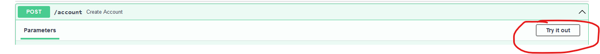

# Mozilla Take-home Exercise: Bank API

## Requirements - [Original PDF](./instructions.pdf)

### API Requirements

- POST `/account`
    - Create an account with the given name and a balance of 0.00.
    - Request Body: `{"name": "#string"}`

- GET `/account/:name`
    - Retrieve an account by its name. If an account with the given name does not exist, return HTTP status 404
      with no response body.
    - Response Body: `{ "name": "#string", "balance": #float }`

- POST `/account/:name/deposit`
    - Deposit money into the account with the given name. If an account with the given name does not exist,
      return HTTP status 404 with no response body.
    - Request Body Format: `{ "amount": #float }`

- POST `/account/:name/withdraw`
    - Withdraw money from the account with the given name. If an account with the given name does not exist,
      return HTTP status 404 with no response body.
    - Request Body Format: `{ "amount": #float }`

## Approach

### Design

Not much to layout here, instructions were explicit and well-documented. I did add some additional behavior based on
common standards for REST APIs:

- Application-wide
    - 422 if `name` doesn't contain non-special characters + whitespace (normally 400, but using FastAPIs defaults to focus on other aspects)
- `POST /account`
    - Returning a `Location` header on 201
    - 409 for conflicting primary keys (account name)
- `POST /deposit` + `POST /withdraw`
    - 422 if `amount` is not in `#.##` or `#` format (normally 400, but using FastAPIs defaults to focus on other aspects)

### Build Tool - [Poetry](https://python-poetry.org/)

Primarily because I saw it being used in https://github.com/mozilla-services/merino-py (fya, there's a typo
of `[Follow the] insturctions` in the readme, under Setup), so its likely familiarity with reviewers
and its approach to packaging dependencies (which was familiar to me thanks to my experience with Gradle, Maven, and
NPM) made it an easy choice for this task.

### Application Setup - [FastApi](https://fastapi.tiangolo.com/) + [Postgres DB](https://hub.docker.com/_/postgres)

Postgres was chosen for its simple, tried-and-true setup, maintainability, and scalability; could have gone with a
non-relational DB given the data requirements, but there wasn't enough of a benefit for this app to dive into unfamiliar 
territory on that front.

FastAPI was primarily chosen due to being, well, fast to develop. My Python isn't nearly as strong as my Java currently,
so I
specifically wanted
a framework that was concise and easy to pick up, but still powerful and familiar to experienced Python devs. Light
research mentioned this framework
in several sources as a strong up-and-comer in the industry, and its concise, type-hint heavy syntax felt familiar
enough to me that I felt I could
focus more on the given task rather than on learning an entire new framework in a moderately unfamiliar language for a
one-off task
(understanding that the actual job will use similar concepts, but in an established codebase with a significantly
different set of requirements and interactions).

### Supporting Libaries

- [SQLAlchemy](https://www.sqlalchemy.org/) - Database ORM Library
    - One of the options recommended by https://fastapi.tiangolo.com/tutorial/sql-databases/ - chosen for compatibility
      with documentation and its independence of framework
      (personal preference is to prioritize reusability of business logic and external integrations regardless of containing framework, unless there are
      significant benefits to native integration)
- [Pydantic](https://pydantic-docs.helpmanual.io/)
    - Paired with SQLAlchemy to perform Schema validation
- [Uvicorn](https://www.uvicorn.org/) - Local ASGI Web Server
    - Comes packaged with FastAPI, used in many examples online, extremely lightweight and quick to set up

## How to Run

### Docker

The intended method for running this is through the docker-compose.yml, either via:

- `docker-compose up --build -d` in terminal of choice from project root directory
- within JetBrains IDE using the runConfiguration provided at `.\.idea\runConfigurations\Docker_Compose` (should already
  be loaded for you)

This will start both the API, which is exposed on http://localhost:8080, and the DB which is only exposed within the
Docker network.

The API container is set up to hot-reload on application changes, so feel free to mess around while it is running.

To view the Swagger, and make REST calls if so desired, you can visit http://localhost:8080/docs (Hit the "Try It Out"
button under each request to create and execute CURL calls)

### Tests

There are some unit tests present, which can be run via `poetry run pytest`

##### Wishlist

I wanted to allow for running locally with a SQLLite in-memory DB (for people without Docker and for Integration Tests), 
but unfortunately I couldn't get SQLAlchemy to create the tables via the same Base instance across the modules. 
You'll find evidence of this in bank/database.py, envs/dev.env, and tests/test_app.

If you know the issue, please let me know (either via email or PR)! Would love to know where I went wrong. 